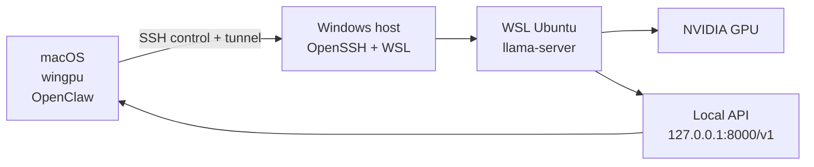

# GPU Bridge

`bridge/` is a Mac-controlled remote GPU workspace for running Qwen with `llama.cpp` on a Windows host through WSL, then exposing a stable OpenAI-compatible endpoint back to macOS.

The published project keeps one stable app contract:

- Base URL: `http://127.0.0.1:8000/v1`
- Served model id: `qwen-local`
- App target: `OpenClaw` on macOS

## What This Project Covers

- Mac-side control with the `wingpu` CLI
- Windows + WSL + NVIDIA runtime management over SSH
- Native `llama.cpp` and TurboQuant-CUDA runtime lanes
- GGUF model catalog and model switching without changing app-side config
- Local benchmark and experiment workflows for long-context Qwen use

## System Shape



## Quick Start

1. Install the CLI:

```bash
uv tool install --from ./bridge/mac wingpu
```

2. Create the project-local config:

```bash
wingpu config init
$EDITOR bridge/config/wingpu.local.toml
```

3. Build or select a runtime and model:

```bash
wingpu build upstream
wingpu runtime set turboquant-cuda
wingpu model set Qwen3.5-27B-Q3_K_M
wingpu kv set --k turbo3 --v turbo3
```

4. Start and verify the local endpoint:

```bash
wingpu start
wingpu status
wingpu models
```

## Read This Next

- [Project Guide](/Users/czy/projects/autoresearch/bridge/docs/README.md)
- [Admin Notes](/Users/czy/projects/autoresearch/bridge/docs/wingpu_admin_notes.md)

## Local-Only Areas

These paths are intentionally kept out of git so the repo can stay publishable while your machine-specific work stays local:

- `bridge/config/wingpu.local.toml`
- `bridge/profiles/*.json` except `template.json`
- `bridge/reports/`
- `bridge/remote-only/wsl-llama/`
- `bridge/mac/.venv/`

## Repository Layout

- `bridge/config/`: publish-safe defaults and model catalog
- `bridge/docs/`: durable project documentation
- `bridge/mac/`: Python `wingpu` controller and utilities
- `bridge/profiles/`: local profile templates
- `bridge/windows/`: Windows-side setup scripts
- `bridge/wsl/`: older reference utilities and support scripts
