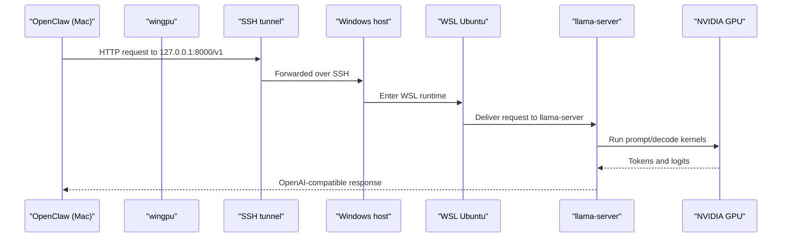
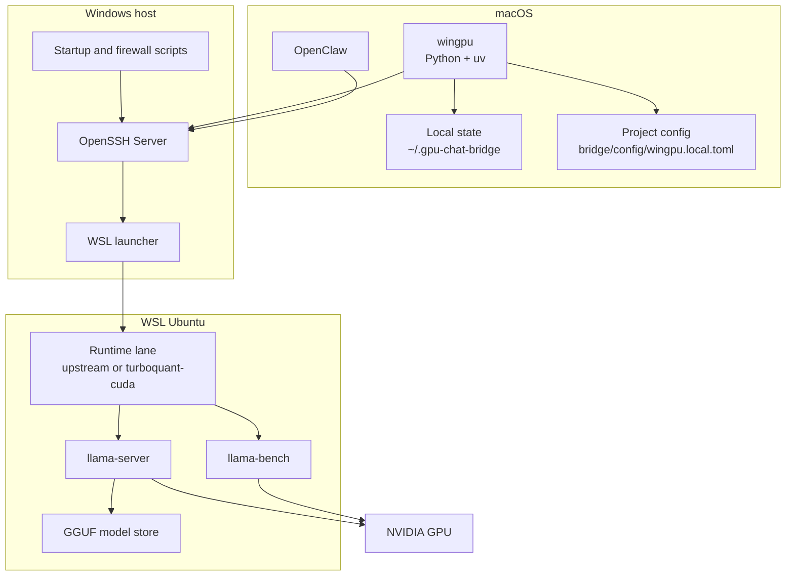

# GPU Bridge Guide

This guide is the main reference for the published `bridge/` project.

It describes the current working system:

- `wingpu` runs on macOS
- the actual model server runs inside WSL Ubuntu on a Windows host
- the runtime uses `llama.cpp`-style servers on an NVIDIA GPU
- apps on the Mac consume one stable local endpoint: `http://127.0.0.1:8000/v1`

## 1. Core Design

The system is intentionally split into a stable outer contract and an experimental inner runtime.

Stable outer contract:

- local base URL: `http://127.0.0.1:8000/v1`
- served model name: `qwen-local`
- consumer app: `OpenClaw`

Experimental inner runtime:

- model file can change
- runtime lane can change
- KV cache type can change
- benchmark settings can change

That design lets us experiment with Qwen, KV compression, and TurboQuant without having to keep reconfiguring the Mac app layer.

## 2. Architecture

### Request path



### Component map



## 3. Key Parts Of The Repository

### `bridge/mac/`

This is the live controller project.

Important files:

- `bridge/mac/pyproject.toml`: Python package and `uv` project
- `bridge/mac/src/wingpu_cli/main.py`: main control-plane implementation
- `bridge/mac/mirror_remote_wsl_llama.sh`: optional remote mirror helper

### `bridge/config/`

This directory separates publish-safe defaults from machine-specific overrides.

- `wingpu.defaults.toml`: safe defaults that can be committed
- `qwen_gguf_catalog.json`: committed model catalog template
- `wingpu.local.toml`: local machine settings, gitignored

### `bridge/windows/`

PowerShell helpers for Windows host preparation:

- SSH/firewall hardening
- startup task setup
- native WSL runtime setup helpers

### `bridge/wsl/`

Older WSL support utilities and reference scripts.

These are not the primary daily control path anymore, but they remain useful as references and experiments.

## 4. Configuration Model

The controller now treats the project directory as the source of truth.

Config sources:

1. committed defaults from `bridge/config/wingpu.defaults.toml`
2. local override from `bridge/config/wingpu.local.toml`
3. explicit CLI or environment overrides

The project-local config is the real working config for your machine.

Typical local fields to set:

- `connection.host`
- `connection.distro`
- `connection.api_key`
- `paths.remote_home`
- `paths.remote_src_root`
- `paths.remote_models_root`

If you use the installed `wingpu` command outside the repo root, set `WINGPU_PROJECT_DIR` to the project or `bridge/` directory so the CLI can still locate the project-local config.

## 5. First-Time Setup

### Windows host

Required:

- OpenSSH Server enabled
- WSL2 with Ubuntu
- NVIDIA driver and WSL GPU support working
- sleep and hibernate disabled for unattended runs on AC power

### WSL Ubuntu

Required:

- build tools
- CUDA toolkit availability for native builds
- source trees under the configured remote source root
- GGUF model files inside the WSL filesystem

From the Mac, after config is in place:

```bash
wingpu admin build-prereqs
wingpu admin experiment-prereqs
wingpu admin cuda-toolkit
```

### Mac

Install the CLI:

```bash
uv tool install --from ./bridge/mac wingpu
```

Create the project-local config:

```bash
wingpu config init
$EDITOR bridge/config/wingpu.local.toml
```

## 6. Daily Workflow

### Build runtime lanes

```bash
wingpu build upstream
wingpu build turboquant-cuda
```

### Select model, runtime, and KV settings

```bash
wingpu model list
wingpu model set Qwen3.5-27B-Q3_K_M
wingpu runtime list
wingpu runtime set turboquant-cuda
wingpu kv show
wingpu kv set --k turbo3 --v turbo3
```

### Start and verify

```bash
wingpu start
wingpu status
wingpu models
```

Expected outcome:

- local API reachable on `127.0.0.1:8000`
- served model remains `qwen-local`
- `OpenClaw` does not need reconfiguration when you switch model or runtime lane

### Benchmark

```bash
wingpu benchmark run
```

## 7. OpenClaw Contract

`OpenClaw` should point to:

- base URL: `http://127.0.0.1:8000/v1`
- provider type: OpenAI-compatible completions
- model id: `qwen-local`

The important design rule is that `OpenClaw` never needs to know the actual GGUF filename or the runtime lane.

## 8. Runtime Lanes

### `upstream`

Native CUDA build of upstream `llama.cpp`.

Use it when you want:

- baseline behavior
- clean comparison runs
- fewer experimental variables

### `turboquant-cuda`

CUDA-focused TurboQuant fork used for KV-cache experiments.

Use it when you want:

- longer-context KV-cache experiments
- memory-pressure comparisons
- TurboQuant vs baseline benchmarks

This lane is experimental and should be treated accordingly.

## 9. Local-Only Working Areas

These areas are intentionally not part of the published surface:

- `bridge/config/wingpu.local.toml`
- `bridge/profiles/*.json` except `template.json`
- `bridge/reports/`
- `bridge/remote-only/wsl-llama/`

This keeps the repo publishable while still leaving room for local notes, mirrored snapshots, and one-off profiles.

## 10. Troubleshooting Checklist

- `wingpu status` should show both a healthy SSH tunnel and a live remote runtime
- `wingpu models` should return `qwen-local`
- if a build fails, rerun the relevant `wingpu admin ...` prerequisite command
- if the runtime starts but generation fails, compare the selected KV cache types against the active runtime lane's supported cache types
- if the installed `wingpu` command cannot find project config, run it from the repo or set `WINGPU_PROJECT_DIR`
